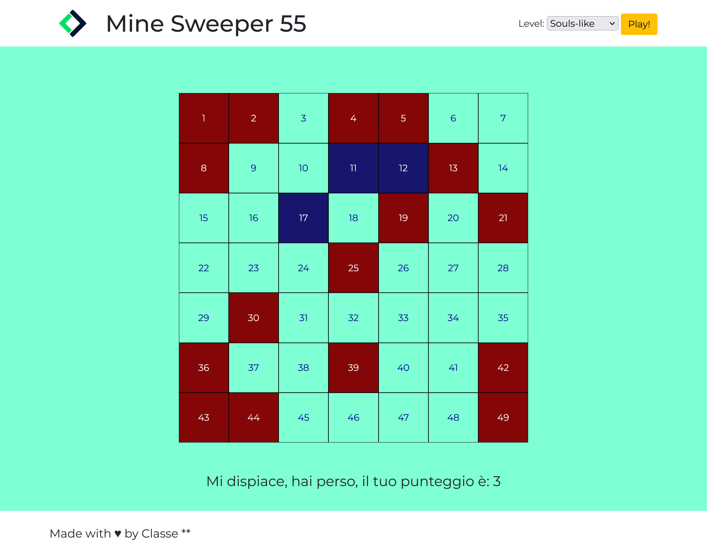

# Consegna
L'utente clicca su un bottone che genererà una griglia di gioco quadrata.
Ogni cella ha un numero progressivo, da 1 a 100.
Ci saranno quindi 10 caselle per ognuna delle 10 righe.
Quando l'utente clicca su ogni cella, la cella cliccata si colora di azzurro ed emetto un messaggio in console con il numero della cella cliccata.

- Step 1: html e css per mettere le basi della schermata di gioco
    - Creare un header con logo e pulsante
    - Creare il main per la griglia di gioco
    - Creare il footer

- Step 2: Creare una griglia 10 x 10
    - Creare le celle
    - Aggiungere un evento al click 
        - Al click la cella si colora di azzurro
        - Stampo in console il numero corrispondente alla cella cliccata

TOOLS JS:
- const/let
- consol.log
- get.ElementByID/querySelector
- addAeventListener
- function
- classList
- .add/.toggle

## Consegna 2

Il computer deve generare 16 numeri casuali nello stesso range della difficoltà prescelta: i funghi magici.
Attenzione: nella stessa cella può essere posizionato al massimo un fungo, perciò nell’array dei funghi non potranno esserci due numeri uguali.
In seguito l'utente clicca su una cella: se il numero è presente nella lista dei numeri generati

- abbiamo calpestato una fungo
- la cella si colora di rosso e la partita termina.

Altrimenti la cella cliccata si colora di azzurro e l'utente può continuare a cliccare sulle altre celle.

La partita termina quando il giocatore clicca su una fungo o quando raggiunge il numero massimo possibile di numeri consentiti (ovvero quando ha rivelato tutte le celle che non sono funghi).

Al termine della partita il software deve comunicare il punteggio, cioè il numero di volte che l’utente ha cliccato su una cella che non era una fungo.

- Creo delle schermate in html e css con un pulsante di restart
    - una per la vittoria
    - una per la sconfitta

<!-- Nota: Se non vi piacciono i funghi potete usare fiori o cacca basta che non mettete bombe - purtroppo il nome della repo al momento non puó essere cambiato. -->

# Bonus
Aggiungere una select accanto al bottone di generazione, che fornisca una scelta tra tre diversi livelli di difficoltà:

- difficoltà 1 ⇒ 100 caselle, con un numero compreso tra 1 e 100, divise in 10 caselle per 10 righe;

- difficoltà 2 ⇒ 81 caselle, con un numero compreso tra 1 e 81, divise in 9 caselle per 9 righe;

- difficoltà 3 ⇒ 49 caselle, con un numero compreso tra 1 e 49, divise in 7 caselle per 7 righe;
